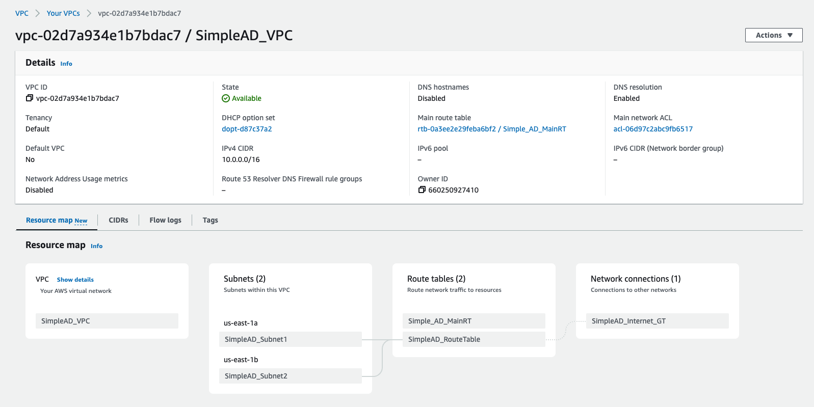

**Nerav Doshi**

Simple AD is a standalone managed directory that is powered by a Samba 4 Active Directory Compatible Server. This guide demonstrates how to configure Azure AD as the cluster identity provider in Azure Red Hat OpenShift. This guide will walk through the creation of an Simple Active Directory (Simple AD) application and configure Red Hat OpenShift Service on AWS (ROSA) to authenticate using Simple AD.

This guide will walk through the following steps:

1. Create a Simple AD directory.
2. Create EC2 instance and configure and Install Active Directory administrative tools.
3. Join EC2 instance to your directory
4. Create users and groups.
5. Grant additional permissions to individual users.
6. Configure the identity provider credentials and URL in ROSA
7. Add cluster-admin or dedicated-admin users
8. Log in and confirm

## Before you Begin

If you are using `zsh` as your shell (which is the default shell on macOS) you may need to run `set -k` to get the below commands to run without errors. [This is because `zsh` disables comments in interactive shells from being used](https://zsh.sourceforge.io/Doc/Release/Options.html).

## Prerequisites

* [AWS CLI](https://docs.aws.amazon.com/cli/latest/userguide/install-cliv2.html)
* [Rosa CLI](https://github.com/openshift/rosa/releases/tag/v1.1.7) v1.1.7
* [jq](https://stedolan.github.io/jq/download/)

## AWS Preparation

1. If this is a brand new AWS account that has never had a AWS Load Balancer installed in it, you should run the following

    ```bash
    aws iam create-service-linked-role --aws-service-name \
    "elasticloadbalancing.amazonaws.com"
    ```

## Create the AWS Virtual Private Cloud (VPC) and Subnets

**Note**: When creating subnets, make sure that subnet(s) are created in availability zones that have ROSA instances types available. If AZ is not "forced", the subnet is created in a random AZ in the region. Force AZ using the `--availability-zone` argument in the `create-subnet` command.

1. Create a VPC for use by SimpleAD

    - Create the VPC and return the ID as `VPC_ID`

      ```
       VPC_ID=`aws ec2 create-vpc --cidr-block 10.0.0.0/16 | jq -r .Vpc.VpcId`
       echo $VPC_ID
      ```

    - Tag the newly created VPC with the cluster name

      ```bash
        aws ec2 create-tags --resources $VPC_ID \
        --tags Key=Name,Value=SimpleAD_VPC
      ```

1. Create two subnets within VPC for different availability zones

    - Create the Subnet1 and return the ID as `SUBNET_ID1`

      ```
      SUBNET_ID1=`aws ec2 create-subnet --vpc-id $VPC_ID --cidr-block 10.0.1.0/24 --availability-zone us-east-1a | jq -r .Subnet.SubnetId`
      echo $SUBNET_ID1
      ```
    - Tag Subnet1

      ```
      aws ec2 create-tags --resources $SUBNET_ID1 \
      --tags Key=Name,Value=SimpleAD_Subnet1
      ```

    - Create the Subnet2 and return the ID as `SUBNET_ID2`

      ```
      SUBNET_ID2=`aws ec2 create-subnet --vpc-id $VPC_ID --cidr-block 10.0.0.0/24 --availability-zone us-east-1b | jq -r .Subnet.SubnetId`
      echo $SUBNET_ID2
      ```
    - Tag Subnet2
      
      ```
      aws ec2 create-tags --resources $SUBNET_ID2 \
      --tags Key=Name,Value=SimpleAD_Subnet2
      ```
1. Create an Internet Gateway for NAT egress traffic

    - Create the Internet gateway and return the ID as `I_GW`

    ```
    I_GW=`aws ec2 create-internet-gateway | jq -r .InternetGateway.InternetGatewayId`
    ```

    - Attach internet gateway to VPC

    ```
    aws ec2 attach-internet-gateway --vpc-id $VPC_ID \ --internet-gateway-id $I_GW | jq .
    ```

    - Tag Internet Gateway for SimpleAD

    ```
    aws ec2 create-tags --resources $I_GW \
    --tags Key=Name,Value=SimpleAD_Internet_GT | jq .
    ```

1. Create a Route Table for NAT egress traffic

    ```
    R_TABLE=`aws ec2 create-route-table --vpc-id $VPC_ID | jq -r .RouteTable.RouteTableId`
    ```

    - Create route 

    ```
    aws ec2 create-route --route-table-id $R_TABLE --destination-cidr-block 0.0.0.0/0 --gateway-id $I_GW | jq .
    ```

    - Describe Route tables

    ```
    aws ec2 describe-route-tables --route-table-id $R_TABLE | jq .
    ```

    - Associate Route table to Subnet Ids

    ```
    aws ec2 associate-route-table --subnet-id $SUBNET_ID1,$SUBNET_ID2 --route-table-id $R_TABLE | jq .
    ```

    - Tag Route table

    ``` 
    aws ec2 create-tags --resources $R_TABLE \
    --tags Key=Name,Value=SimpleAD_RouteTable | jq .
    ```

The new VPC with all routetable and internet gateway should be visible in the AWS console

      

## Create a Simple AD directory
Simple AD provides a subset of the features offered by AWS Managed Microsoft AD, including the ability to manage user accounts and group memberships, create and apply group policies, securely connect to Amazon EC2 instances

    - To create Simple AD directory 

    ```
    DIRECTORY_ID=`aws ds create-directory --name lab.example.com --password SimpleAD1234 --short-name sad --size Small --vpc-settings SubnetIds=$SUBNET_ID1,$SUBNET_ID2,VpcId=$VPC_ID`
    echo $DIRECTORY_ID
    ```
One can view the Simple AD under Directory Services on AWS console

      
## Create EC2 instance and configure and Install Active Directory administrative tools

1. Create Security group
    ```
    SG_ID=`aws ec2 create-security-group --group-name rdp-access --description "Allow RDP access" --vpc-id $VPC_ID`
    echo $SG_ID
    ```

  - Run the following command to add an inbound rule to the security group to allow all traffic into RDP port 3389:

    ```
    aws ec2 authorize-security-group-ingress --group-id $SG_ID --protocol tcp --port 3389 --cidr 0.0.0.0/0
    ```

  - Run the following command to add an outbound rule to the security group to allow all traffic to the internet:

    ```
    aws ec2 authorize-security-group-egress --group-id <group-id> --protocol all --cidr 0.0.0.0/0
    ```  

1. Create EC2 instance with Windows Server 2019 base image

    AMI_ID=ami-024614f01f42eeb66

    ```
    aws ec2 run-instances --image-id $AMI_ID --instance-type t2.micro --key-name simpleAD --subnet-id $SUBNET_ID1 --security-group-ids $SG_ID --associate-public-ip-address --tag-specifications 'ResourceType=instance,Tags=[{Key=Name,Value=SimpleAd_EC2}]'
    ```


1. Connect EC2 instance using the following [instructions](https://docs.aws.amazon.com/AWSEC2/latest/WindowsGuide/EC2_GetStarted.html#ec2-connect-to-instance-windows)

1. Join EC2 instance to Simple AD active directory [instructions] (https://docs.aws.amazon.com/directoryservice/latest/admin-guide/simple_ad_launching_instance.html)

1. Install [AD tools and add users and groups ](https://docs.aws.amazon.com/directoryservice/latest/admin-guide/simple_ad_manage_users_groups.html) on Windows 2016 - 2019 server 

1. Verify that you can find the active directory on Windows machine

1. Go to the Directory Service and Open the Simple AD directory and copy the Directory DNS name and DNS address

ROSA_CLUSTER_NAME=simplead-test

VPC = 10.0.0.0/16

PUBLIC_SUBNET = 10.0.2.0/23

PRIVATE_SUBNET = 10.0.4.0/23

SimpleAD = 10.0.0.0/24

SimpleAD = 10.0.1.0/24
